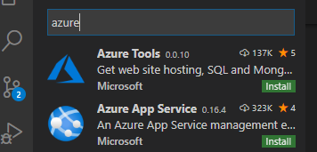
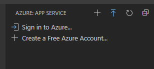
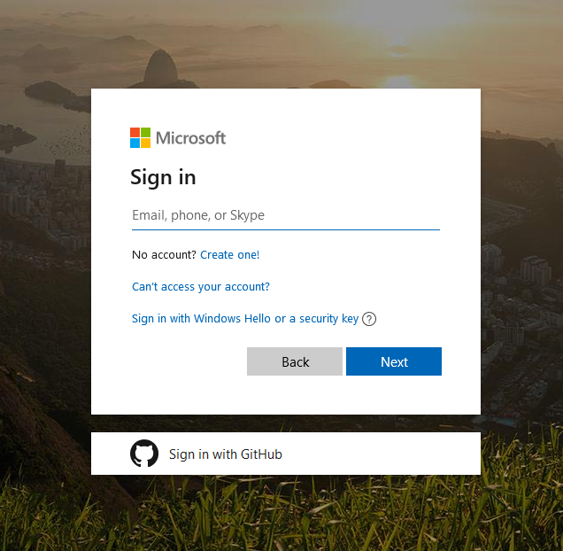
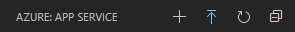
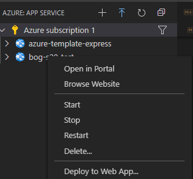
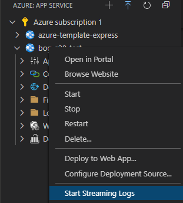

# Bits of Good Azure Express Template

Use this repo as a template for easily deploying your Express application to Microsoft Azure.

## Questions

### Setup

1. ***What do I need to get started?***

    You'll need install the [VSCode Azure App Service extension](https://marketplace.visualstudio.com/items?itemName=ms-azuretools.vscode-azureappservice) to easily upload and deploy your source code as an [App Service](https://docs.microsoft.com/en-us/azure/app-service/) on Azure:

    

2. ***Do I need to configure my Express app?***

    Yes! You'll need to run your server on port `8080` for deployment. That's it.

3. ***What files do I need to copy over to my repo?***

    - `process.json` - replace `index.js` inside it with whatever JavaScript file you run your Express application from

    - `.deployment` - this tells Azure to install your NPM dependencies when it rebuilds your Express application as an App Service

### Deployment

4. ***How do I actually "deploy" my Express app from VSCode?***

    1. Open up the Azure sidebar in VSCode
    
        

    2. Sign in to Azure (a web page should open)

        

    3. Sign in to Microsoft using the account given to you by Bits of Good

        

    4. Click the plus at the top of the Azure App Service sidebar in VSCode to "Create New Web App"

        

    5. Name your app using the following naming convention:
        
        ```
        bog-<semester><year>-<project shorthand>
        ```

        For example, the `Nonprofit Portal` project for the `Fall 2019` semester would use the following name:
        ```
        bog-fall19-npp
        ```

    6. Select the right Node version for your project. **Choose LTS to be safe!***

    7. Now whenever you want to deploy your app, just right click your app in the Azure App Service sidebar and click `Deploy to Web App...`

        


### Checking your deployment

5. ***How do I see the logs for my deployment in VSCode?***

    Right click your app in the Azure App Service sidebar and click `Start Streaming Logs...`

    


    

